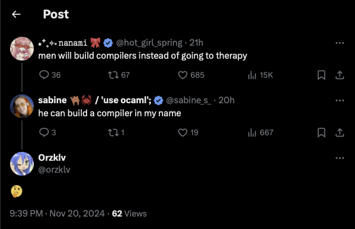

<p align="center">
    
</p>

<p align="center">
    <h3 align="center">A toy compiler named after Sabine.</h3>
</p>

<p align="center">
    
    <a href="https://github.com/sabine-lang/sabine/actions/workflows/test.yml"></a>
</p>

## Motivation



The idea actually sparked after this xeet: [Source](https://x.com/sabine_s_/status/1859272820720537970?s=61).
I was just havin' a good day doin' my job and spamming shit at X. Well, saw this post and I was like: "Aight,
we ballin' :ball:!".

> I ain't gonna ship any production on this language, the project solely serves for entertainment &
educational purpose

## Development

The project primarily utilizes Nix package manager for development. You need to have Nix package manager
installed on your machine. Lowkey, you migth try running project with your distro's coreutils dev toolchain
but I'm not going to guarantee you anything.

```shell
# This will use your current NixOS'es nixpkgs
nix-shell

# Utilize flake's locked nixpkgs version
nix develop -c $SHELL
```

## Compiling

The project supports 2 most popular build systems like cmake and gnumake. LLVM is set to default, you have
to pass params for gnu. So, assuming whatever we have, you have 2 options:

### nix run / nix build

```shell
# For defaulted LLVM
nix build .

# For GNU
nix build .#gnu
```

### Manual

```shell
# GNU / Make
mkdir -p ./build
make
./sabine

# LLVM / CMake
mkdir -p ./build
cd ./build
cmake ..
cmake --build .
./sabine
```

## Running (easily)

Thanks to all those Nix efforts, you can run the project without having need to clone this repository
simply by running:

```shell
# Defaulted LLVM host
nix run github:orzklv/sabine

# Optional GNU host
nix run github:orzklv/sabine#gnu
```

## License

This project is licensed under WTFPL license which grants you what the fuckever you want. Just don't
roast me posting shit on X. I'm not that nerd of geek as you may think.

<p align="center">
    
</p>
